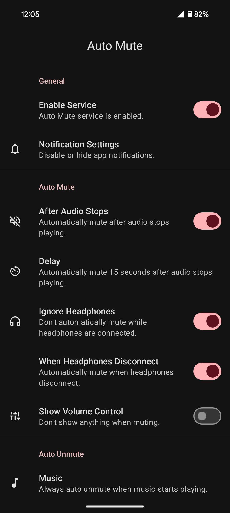
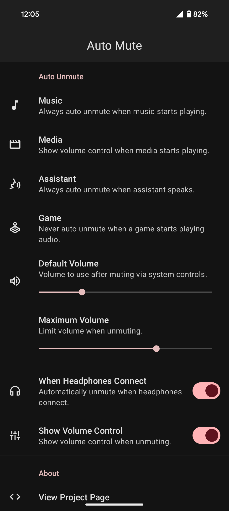
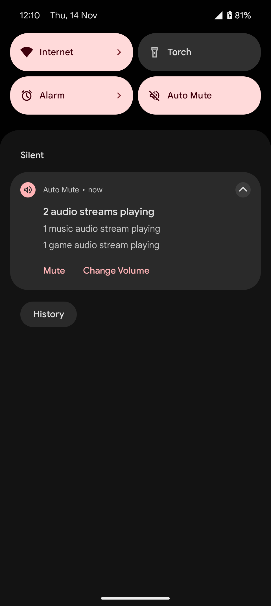

# Auto Mute [](https://www.gnu.org/licenses/gpl-3.0)


Automatically mute or unmute your media volume based on the type of audio playing for Android 8.0 and up.

Auto Mute can be configured to automatically unmute media audio or show the media volume control when music, media, assistant or game audio starts playing. It can also automatically mute after audio stops playing.

[](https://play.google.com/store/apps/details?id=xyz.sommd.automute&pcampaignid=MKT-Other-global-all-co-prtnr-py-PartBadge-Mar2515-1)

[Or download the latest release.](https://github.com/sommd/auto-mute/releases/latest)

## Screenshots

<p align="center">
    
    
    
</p>

## FAQ

#### How do I hide the notification?

##### Android 8

Notification Settings > Importance > Low

##### Android 9

Notification Settings > Behavior > Show silently and minimize

##### Android 10 and up

Notification Settings > Minimize

#### Why does \<app> count as music when it's not?

Auto Mute uses the audio stream's [AudioAttributes](https://developer.android.com/reference/android/media/AudioAttributes.html) (specifically the [usage](https://developer.android.com/reference/android/media/AudioAttributes.Builder.html#setUsage(int)) and [contentType](https://developer.android.com/reference/android/media/AudioAttributes.Builder.html#setContentType(int)) properties) to identify the type of audio. AudioAttributes was only added in Android 5.0, so not all apps have been updated to use it. Even if an app does use AudioAttributes, if the app sets the usage and contentType incorrectly Auto Mute may misidentify the audio type.

#### Why doesn't it detect the audio type from the app?

Android only passes an [anonymized copy](https://android.googlesource.com/platform/frameworks/base/+/android-8.1.0_r1/media/java/android/media/AudioPlaybackConfiguration.java#222) of each [AudioPlaybackConfiguration](https://developer.android.com/reference/android/media/AudioPlaybackConfiguration.html) to the app, so it's impossible to detect which audio stream is coming from which app.

#### Why does Auto Mute require Android 8.0 and up?

The API used to monitor audio streams ([AudioManager.getActivePlaybackConfigurations()](https://developer.android.com/reference/android/media/AudioManager.html#getActivePlaybackConfigurations()) and [AudioManager.AudioPlaybackCallback](https://developer.android.com/reference/android/media/AudioManager.AudioPlaybackCallback.html)) was only added in Android 8.0 (API 26).

## Contributing

1. Fork and/or clone the repo and open it in Android Studio.
2. Make some changes and commit.
    - (With [nice commit messages](https://github.com/agis/git-style-guide#commits))
3. Create a pull request.

## License

```
Copyright (C) 2018 David Sommerich

This program is free software: you can redistribute it and/or modify
it under the terms of the GNU General Public License as published by
the Free Software Foundation, either version 3 of the License, or
(at your option) any later version.

This program is distributed in the hope that it will be useful,
but WITHOUT ANY WARRANTY; without even the implied warranty of
MERCHANTABILITY or FITNESS FOR A PARTICULAR PURPOSE.  See the
GNU General Public License for more details.

You should have received a copy of the GNU General Public License
along with this program.  If not, see <https://www.gnu.org/licenses/>.
```

See [LICENSE](/LICENSE).

Google Play and the Google Play logo are trademarks of Google LLC.
